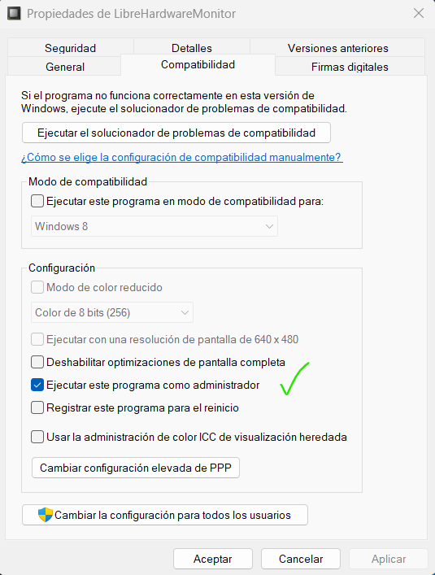
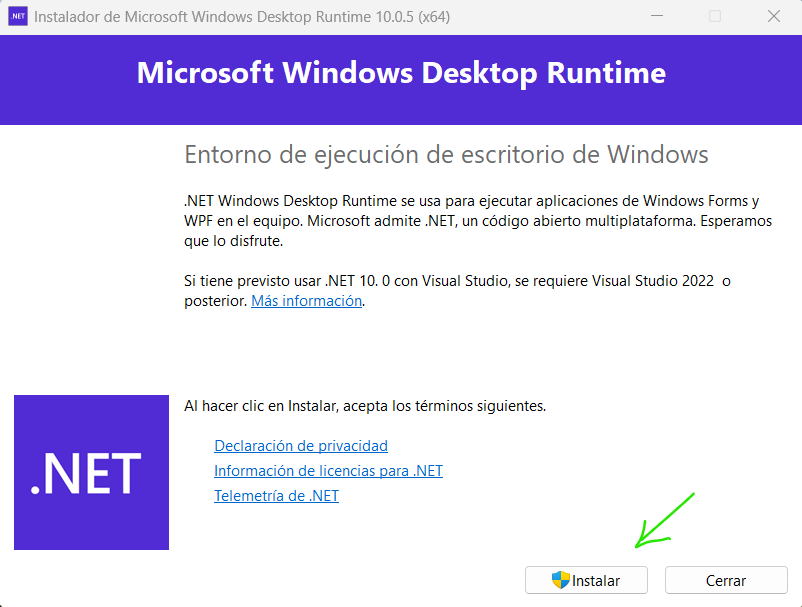
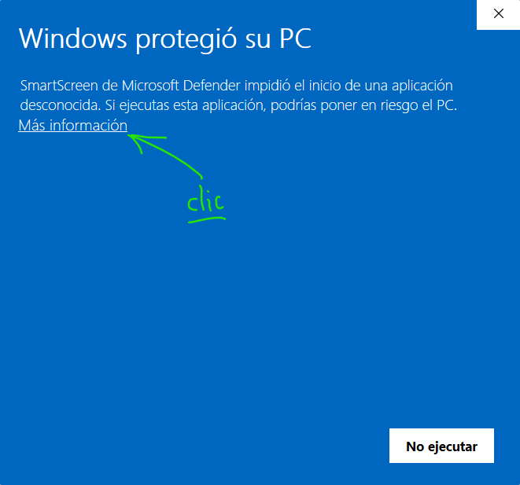
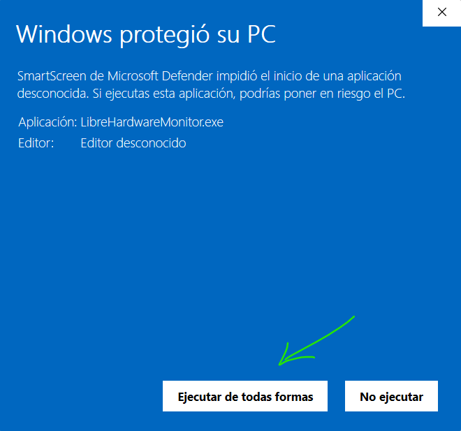
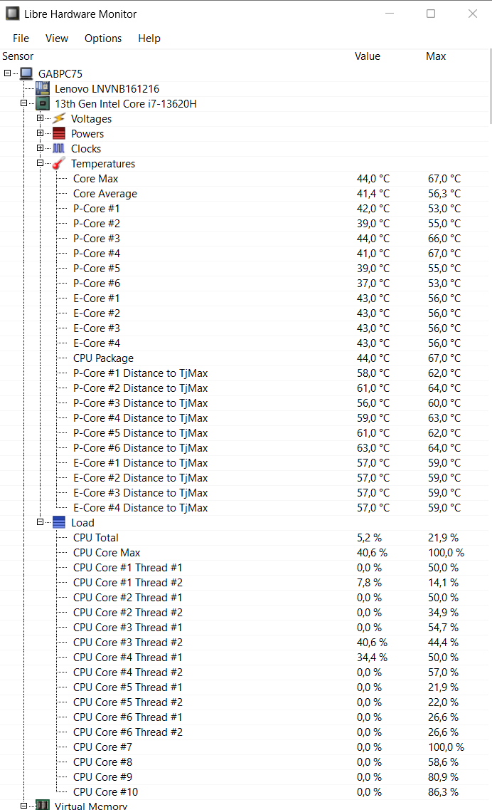

# LibreHardwareMonitor en Windows

## ¿Qué es y para qué sirve?

**`LibreHardwareMonitor`** (disponible en `GitHub`) es una aplicación gratuita y de código abierto para Windows diseñada para **supervisar en tiempo real los sensores de hardware de una computadora**. Es una versión mejorada ("fork") de *Open Hardware Monitor* que ofrece mayor compatibilidad con componentes modernos.

### ¿Qué hace `LibreHardwareMonitor`?

- **Lee sensores de componentes:** Monitorea la temperatura, velocidad de ventiladores, voltajes, carga y velocidades de reloj (frecuencias) de la CPU, GPU (tarjetas gráficas Nvidia/AMD), RAM, discos duros (HDD, SSD, NVMe) y placas base.
- **Muestra datos en tiempo real:** Presenta esta información en una interfaz gráfica de usuario (GUI) basada en Windows Forms, y también puede integrarse en la bandeja del sistema (system tray).
- **Proporciona registros de datos:** Puede registrar (log) los datos históricos del hardware para identificar patrones o problemas recurrentes.
- **Control de ventiladores:** Incluye soporte para controlar la velocidad de los ventiladores en ciertas placas base.

### ¿Para qué sirve?

1. **Diagnóstico de sobrecalentamiento:** Permite verificar si la CPU o GPU están alcanzando temperaturas peligrosas, ayudando a prevenir apagones o daños en los componentes.
2. **Monitoreo de rendimiento:** Útil para jugadores (gamers) o profesionales que necesitan ver cómo el sistema carga componentes durante tareas pesadas.
3. **Solución de problemas (Troubleshooting):** Si una computadora se congela o funciona lento, sirve para identificar cuál componente está al 100% de carga o fallando.
4. **Verificación de OC (Overclocking):** Ayuda a los entusiastas a monitorear voltajes y frecuencias al intentar obtener mayor rendimiento de sus equipos.

### Características clave en GitHub

- **Ligero y Portable:** No requiere instalación, simplemente se descarga el ZIP, se extrae y se ejecuta.
- **Gratis y Seguro:** Al ser de código abierto (Open Source), la comunidad audita constantemente el código.
- **Alta compatibilidad:** Compatible con la mayoría de componentes modernos, incluidos los últimos procesadores Intel y AMD.

> *Nota: Para que el programa pueda leer todos los sensores (especialmente los de la placa base), a veces requiere ser ejecutado con privilegios de administrador.*

---

## Instalación de `LibreHardwareMonitor`

Instalar **`LibreHardwareMonitor`** desde `GitHub` en Windows es un proceso sencillo que no requiere una instalación tradicional (es "portable"). Aquí tienes los pasos detallados:

### Pasos para instalar/ejecutar `LibreHardwareMonitor`

1. **Visita el Repositorio de GitHub:** Dirígete a la página oficial del proyecto en GitHub: [**LibreHardwareMonitor/LibreHardwareMonitor**](https://github.com/LibreHardwaRemonitor/LibreHardwareMonitor).
2. **Descarga la última versión (Releases):**
    - En la página principal, busca a la derecha la sección **"Releases"**.
    - Haz clic en la última versión estable (suele decir "Latest").
    - Descarga el archivo ZIP (por ejemplo, `LibreHardwareMonitor-netX.X.X.zip`).
3. **Descomprime el archivo:**
    - Una vez descargado, ve a tu carpeta de Descargas.
    - Haz clic derecho sobre el archivo ZIP y selecciona **"Extraer todo..."**.
    - Elige una carpeta en tu ordenador (por ejemplo, en `C:\Program Files\LibreHardwareMonitor` o simplemente en el Escritorio).
4. **Ejecutar la aplicación:**
    - Abre la carpeta descomprimida.
    - Busca el archivo `LibreHardwareMonitor.exe` y haz doble clic para iniciarlo.
5. **Permisos de Administrador:**
    - Es posible que el programa te pida permisos de administrador para leer correctamente todos los sensores de temperatura y ventiladores de tu equipo.
    - Acepta los permisos de Windows.

---

## Notas Importantes

- **Es portable:** No necesitas un instalador `.msi` o `.exe` que modifique el registro de Windows. Simplemente borra la carpeta si quieres desinstalarlo.
- **Requisito .NET:** `LibreHardwareMonitor` requiere que tengas instalado **.NET Framework 4.7.2** o superior o **.NET 6.0/10.0** (la mayoría de Windows 10/11 ya lo tienen). Pero si no y lo pide, debes instalarlo, lo pedirá al momento de ejecutarse.

    

- **Falsos positivos:** A veces, al ser un software que interactúa con el hardware, el antivirus (Windows Defender en mí caso) puede marcarlo. Es un software seguro y de código abierto.

    

    

- Es probable que pida instalar alguna librería más, luego se ejecutará sin problemas.

    

---

## BONUS

El siguiente video muestra como descargar, instalar y ejecutar la aplicación, además de realizar una demostración de su uso práctico. **¡Ojo! NO ES la versión de pago de** [LibreHardwareMonitor.com](http://LibreHardwareMonitor.com), hablamos de un `software libre` en un repositorio de GitHub.✨

[DOWNLOAD THIS NOW (LibreHardwareMonitor) - EVERYONE sholud try this FREE utility NOW!](https://www.youtube.com/watch?v=sX2ThUWNXio)

---

🫵😎💫
