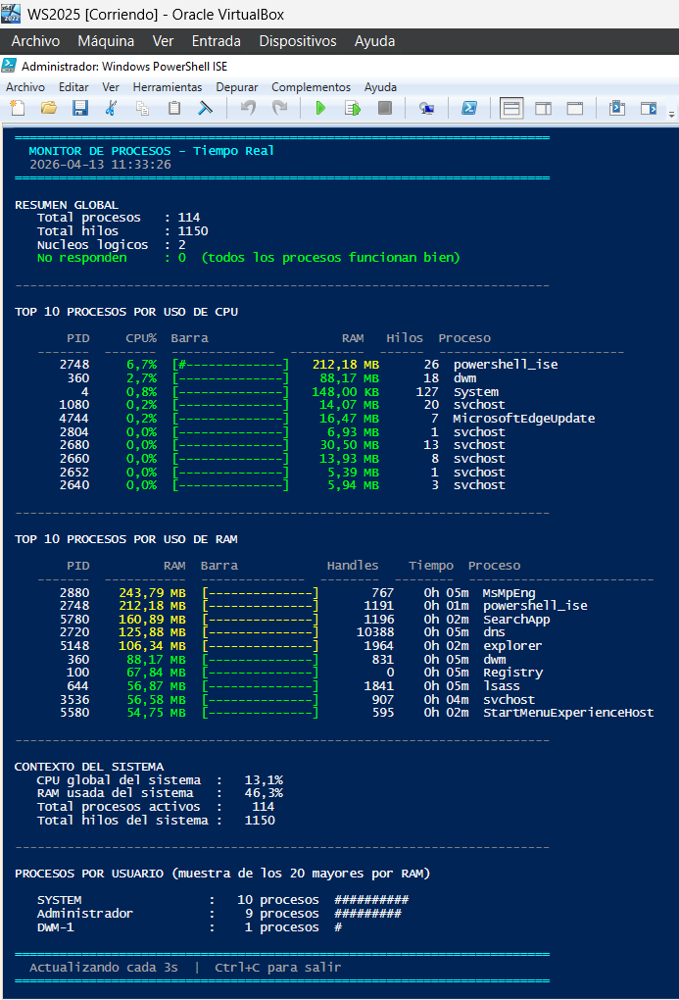
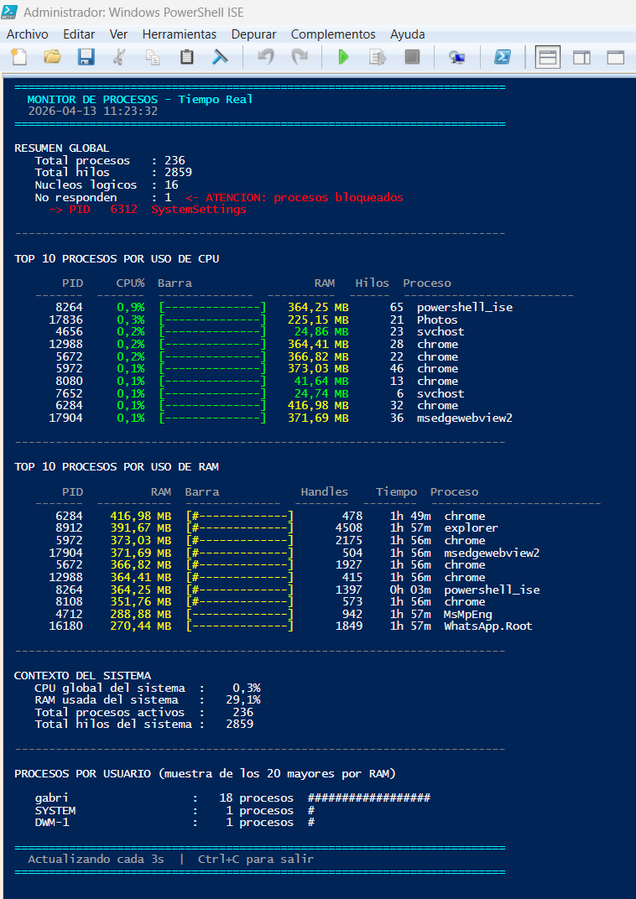

# procesos_monitor.ps1

## Mapeo del script

```powershell
procesos_monitor.ps1
│
├── Set-ExecutionPolicy
├── Configuracion         -> TopN, umbrales CPU y RAM, mostrar usuario
│
├── Inicializacion
│   ├── $NucleosLogicos   -> para normalizar el % de CPU
│   ├── $LecturaAnterior  -> hashtable PID -> CPU acumulada (1a lectura)
│   └── Start-Sleep 2s    -> intervalo de calibracion
│
├── Funciones auxiliares
│   ├── Get-BytesLegibles
│   ├── Get-Barra
│   ├── Get-ColorCPU, Get-ColorRAM
│   ├── Get-Truncado
│   ├── Get-PorcentajeCPU    -> calcula % real con delta entre lecturas
│   └── Get-UsuarioProceso   -> via Win32_Process.GetOwner() + cache
│
├── Show-Procesos
│   ├── Seccion 1 -> Resumen: total, hilos, no responden (bloqueados)
│   ├── Seccion 2 -> Top N por CPU con tabla y alertas inline
│   ├── Seccion 3 -> Top N por RAM con handles y tiempo activo
│   ├── Seccion 4 -> Contexto global CPU y RAM del sistema
│   └── Seccion 5 -> Procesos agrupados por usuario
│
├── Start-Monitor
└── Punto de entrada
```

### Novedades de este script

1. `$script:Variable` **→ ámbitos en PowerShell**
En PowerShell las variables tienen ámbitos igual que en Python. Cuando modificamos `$LecturaAnterior` dentro de `Show-Procesos`, necesitamos indicar que queremos cambiar la variable del ámbito del script, no crear una copia local. Para eso usamos el prefijo `$script:`.

    ```powershell
    # Sin prefijo -> crea una variable local, la original no cambia
    $LecturaAnterior = $NuevaLectura          # incorrecto
    
    # Con prefijo -> modifica la variable del script
    $script:LecturaAnterior = $NuevaLectura   # correcto
    ```

2. `[PSCustomObject]` **→ objetos personalizados**
En Python usamos diccionarios o dataclasses para agrupar datos. En PowerShell la forma más elegante es `[PSCustomObject]` con `@{}`. Permite crear objetos con propiedades con nombre que luego se pueden ordenar, filtrar y formatear igual que los objetos nativos de PowerShell.
3. **`??` → operador de fusión nula (en versión 7+ de PS)**
El operador `??` devuelve el valor de la izquierda si no es `$null`, o el de la derecha si lo es. Es idéntico al operador `or` de Python para valores nulos:

    ```powershell
    # Solo funciona en PowerShell 7+
    $PorUsuario[$User] = ($PorUsuario[$User] ?? 0) + 1
    # equivale en Python a:
    # por_usuario[user] = por_usuario.get(user, 0) + 1
    ```

4. **Consideraciones**: Visto que el operador `??` es de **PowerShell 7.0**, pero Windows 10, 11 y Server incluyen **PowerShell 5.1** de serie. Por lo tanto, tendremos que usar el `if/else` explícito que funciona en cualquier versión:

    ```powershell
    # Compatible con PowerShell 5.1, 6 y 7
    if ($PorUsuario.ContainsKey($User)) {
        $PorUsuario[$User] = $PorUsuario[$User] + 1
    } else {
        $PorUsuario[$User] = 1
    }
    ```

    PowerShell 7 es de código abierto y multiplataforma (corre en Linux y Mac también), pero Microsoft decidió no sustituir la versión 5.1 que viene integrada en Windows porque podría romper scripts de administración existentes. PS 5.1 y PS 7 conviven en el mismo equipo si instalas PS 7 manualmente.

    A continuación, vamos a considerar lo siguiente para todos los scripts.

    | Característica | PowerShell 5.1 ✅ | PowerShell 7+ únicamente ❌ |
    | --- | --- | --- |
    | Operador nulo | `if/else` explícito | `??` |
    | Condicional nulo | `if ($x -ne $null)` | `$x?.Propiedad` |
    | Foreach paralelo | `foreach` normal | `ForEach-Object -Parallel` |
    | Ternario | `if/else` explícito | `$a ? $b : $c` |

5. **"Not Responding" vs zombie**
En Windows no existen los procesos zombie como en Linux. El equivalente más cercano es un proceso en estado "Not Responding": sigue ocupando memoria y aparece en la lista, pero no procesa mensajes ni responde al sistema operativo. Es el típico programa que se queda "colgado".

> 💡 **Analogía del % de CPU con dos lecturas:** Imagina que quieres saber a qué velocidad corre un atleta en una pista de atletismo. No puedes saberlo mirándolo en un único momento: solo ves dónde está. Necesitas apuntar su posición, esperar unos segundos, apuntar de nuevo y calcular cuánto avanzó. Eso es exactamente lo que hace `Get-PorcentajeCPU`: apunta los segundos de CPU consumidos, espera el intervalo y calcula cuánto consumió en ese tiempo.

---

### Código del script

```powershell
# ==============================================================================
#  procesos_monitor.ps1 - Monitor de Procesos en PowerShell
#  Descripcion : Monitoriza en tiempo real los procesos en ejecucion:
#                top consumidores de CPU y RAM, estados y resumen general.
#  Requisitos  : PowerShell 5.1 o superior (incluido en Windows 10/11/Server).
#                Compatible con PowerShell 5.1, 6 y 7.
#  Uso         : .\procesos_monitor.ps1
# ==============================================================================

# ------------------------------------------------------------------------------
#  NOTA DE COMPATIBILIDAD
#
#  Este script esta escrito para PowerShell 5.1, que es la version incluida
#  por defecto en Windows 10, Windows 11 y Windows Server.
#
#  Operadores que NO usamos por ser exclusivos de PowerShell 7+:
#    ??   (fusion nula)     -> sustituido por if/else explicito
#    ?    (null conditional) -> no se usa en este script
#
#  Para comprobar tu version de PowerShell ejecuta:
#    $PSVersionTable.PSVersion
# ------------------------------------------------------------------------------

Set-ExecutionPolicy -ExecutionPolicy Bypass -Scope Process -Force

# ==============================================================================
#  CONFIGURACION
# ==============================================================================
$IntervaloSegundos = 3       # Segundos entre actualizaciones
$TopN              = 10      # Cuantos procesos mostrar en cada ranking
$UmbralCPUProc     = 50      # % de CPU a partir del cual alertamos
$UmbralRAMMB       = 500     # MB de RAM a partir del cual alertamos
$MostrarUsuario    = $true   # Mostrar usuario propietario de cada proceso

# ==============================================================================
#  INICIALIZACION
#
#  Para calcular el % de CPU actual de cada proceso necesitamos dos lecturas
#  separadas en el tiempo. Get-Process devuelve segundos acumulados de CPU,
#  no el porcentaje actual. Calculamos el % nosotros mismos midiendo la
#  diferencia entre dos lecturas dividida por el tiempo transcurrido.
#
#  Analogia: igual que medir la velocidad de un coche necesitas saber donde
#  estaba hace un momento y donde esta ahora. Una sola lectura no basta.
# ==============================================================================

Write-Host ""
Write-Host "  Iniciando monitor de procesos..." -ForegroundColor Cyan
Write-Host "  Calibrando (espera 2 segundos)..." -ForegroundColor Gray
Write-Host ""

# Numero de nucleos logicos del sistema
# Lo necesitamos para normalizar el % de CPU por proceso.
# En Windows, Get-Process puede reportar > 100% en sistemas multinucleo
# porque acumula el uso de todos los nucleos. Dividiendo por el numero
# de nucleos obtenemos el % real sobre el total del sistema.
$NucleosLogicos = (Get-CimInstance Win32_Processor |
    Measure-Object -Property NumberOfLogicalProcessors -Sum).Sum

# Primera lectura de referencia: guardamos los segundos de CPU acumulados
# de cada proceso identificado por su PID.
# Hashtable: clave = PID, valor = segundos de CPU en ese momento
$LecturaAnterior = @{}
$TiempoAnterior  = Get-Date

Get-Process -ErrorAction SilentlyContinue | ForEach-Object {
    if ($_.CPU -ne $null) {
        $LecturaAnterior[$_.Id] = $_.CPU
    }
}

Start-Sleep -Seconds 2

Write-Host "  Listo. Arrancando..." -ForegroundColor Green
Start-Sleep -Seconds 1

# ==============================================================================
#  FUNCIONES AUXILIARES
# ==============================================================================

function Clear-Pantalla { Clear-Host }

function Get-BytesLegibles {
    param([long]$Bytes)
    if     ($Bytes -ge 1TB) { return "{0:N2} TB" -f ($Bytes / 1TB) }
    elseif ($Bytes -ge 1GB) { return "{0:N2} GB" -f ($Bytes / 1GB) }
    elseif ($Bytes -ge 1MB) { return "{0:N2} MB" -f ($Bytes / 1MB) }
    elseif ($Bytes -ge 1KB) { return "{0:N2} KB" -f ($Bytes / 1KB) }
    else                    { return "$Bytes B"                     }
}

function Get-Barra {
    param([double]$Pct, [int]$Long = 14)
    if ($Pct -lt 0)   { $Pct = 0 }
    if ($Pct -gt 100) { $Pct = 100 }
    $Llenos = [int](($Pct / 100) * $Long)
    $Vacios = $Long - $Llenos
    return "[{0}]" -f (("#" * $Llenos) + ("-" * $Vacios))
}

function Get-ColorCPU {
    param([double]$Pct)
    if     ($Pct -lt 20)             { return "Green"  }
    elseif ($Pct -lt $UmbralCPUProc) { return "Yellow" }
    else                             { return "Red"    }
}

function Get-ColorRAM {
    param([long]$Bytes)
    $MB = $Bytes / 1MB
    if     ($MB -lt 100)          { return "Green"  }
    elseif ($MB -lt $UmbralRAMMB) { return "Yellow" }
    else                          { return "Red"    }
}

function Get-Truncado {
    param([string]$Texto, [int]$Max)
    if ($Texto.Length -gt $Max) { return $Texto.Substring(0, $Max - 3) + "..." }
    return $Texto
}

# --- Calcular % de CPU actual por proceso ------------------------------------
# Compara la CPU acumulada actual con la lectura anterior y calcula
# que porcentaje del tiempo total de CPU ha consumido este proceso.
#
function Get-PorcentajeCPU {
    param(
        [int]$ProcID,
        [double]$CPUActual,
        [double]$Segundos
    )

    # Si no tenemos lectura anterior de este proceso devolvemos 0
    if (-not $LecturaAnterior.ContainsKey($ProcID)) { return 0 }
    if ($Segundos -le 0) { return 0 }

    $DeltaCPU = $CPUActual - $LecturaAnterior[$ProcID]
    if ($DeltaCPU -lt 0) { return 0 }   # El proceso se reinicio

    # Dividimos por nucleos para obtener % sobre el sistema completo
    $Pct = ($DeltaCPU / $Segundos / $NucleosLogicos) * 100
    return [math]::Round([math]::Min($Pct, 100), 1)
}

# --- Cache de usuarios por PID -----------------------------------------------
# Consultar el usuario de un proceso via WMI es lento.
# Usamos un cache para no repetir la consulta en cada ciclo.
# La primera vez que pedimos el usuario de un PID lo guardamos,
# y las siguientes veces lo devolvemos directamente del cache.
#
$CacheUsuarios = @{}

function Get-UsuarioProceso {
    param([int]$ProcID)

    if ($CacheUsuarios.ContainsKey($ProcID)) {
        return $CacheUsuarios[$ProcID]
    }

    try {
        $WMIProc = Get-CimInstance -ClassName Win32_Process `
                                   -Filter "ProcessId=$ProcID" `
                                   -ErrorAction Stop
        $Owner   = $WMIProc | Invoke-CimMethod -MethodName GetOwner `
                                               -ErrorAction Stop
        if ($Owner.User) {
            $NombreUsuario = $Owner.User
        } else {
            $NombreUsuario = "SYSTEM"
        }
    }
    catch {
        $NombreUsuario = "N/A"
    }

    $CacheUsuarios[$ProcID] = $NombreUsuario
    return $NombreUsuario
}

# ==============================================================================
#  FUNCION PRINCIPAL
# ==============================================================================
function Show-Procesos {

    $Ahora = Get-Date -Format "yyyy-MM-dd HH:mm:ss"

    # Tiempo transcurrido desde la ultima lectura
    $TiempoActual     = Get-Date
    $SegTranscurridos = ($TiempoActual - $TiempoAnterior).TotalSeconds

    # --- Obtener todos los procesos ------------------------------------------
    # WorkingSet64  -> RAM fisica usada en bytes (equivale al RSS de Linux)
    # CPU           -> segundos de CPU acumulados (NO es el % actual)
    # Threads.Count -> numero de hilos del proceso
    # HandleCount   -> handles abiertos: ficheros, sockets, claves de registro...
    # Responding    -> $true si el proceso responde, $false si esta bloqueado
    $TodosProcesos = Get-Process -ErrorAction SilentlyContinue

    # --- Calcular % de CPU y construir lista de datos ------------------------
    $NuevaLectura  = @{}
    $DatosProcesos = @()

    foreach ($Proc in $TodosProcesos) {

        # Guardamos la CPU actual para usarla como referencia en el proximo ciclo
        if ($Proc.CPU -ne $null) {
            $NuevaLectura[$Proc.Id] = $Proc.CPU
            $CPUActual = $Proc.CPU
        } else {
            $NuevaLectura[$Proc.Id] = 0
            $CPUActual = 0
        }

        $PctCPU = Get-PorcentajeCPU -ProcID $Proc.Id `
                                    -CPUActual $CPUActual `
                                    -Segundos $SegTranscurridos

        # Tiempo que lleva en marcha el proceso
        $UptimeStr = "N/A"
        try {
            if ($Proc.StartTime -ne $null) {
                $Uptime    = (Get-Date) - $Proc.StartTime
                $UptimeStr = "{0}h {1:D2}m" -f ([int]$Uptime.TotalHours), $Uptime.Minutes
            }
        } catch { }

        # Comprobamos si el proceso responde
        # En PowerShell 5.1 la propiedad Responding puede no estar disponible
        # para todos los procesos, la leemos con precaucion
        $Responde = $true
        try { $Responde = $Proc.Responding } catch { }

        # Creamos un objeto personalizado con todos los datos del proceso
        # [PSCustomObject] es la forma de PowerShell de crear objetos
        # con propiedades con nombre, equivalente a un dict o dataclass en Python
        $Objeto = New-Object PSObject -Property @{
            PID      = $Proc.Id
            Nombre   = $Proc.ProcessName
            PctCPU   = $PctCPU
            RAMBytes = $Proc.WorkingSet64
            Hilos    = $Proc.Threads.Count
            Handles  = $Proc.HandleCount
            Responde = $Responde
            Uptime   = $UptimeStr
        }
        $DatosProcesos += $Objeto
    }

    # Actualizamos las variables del scope del script para el proximo ciclo
    # $script: indica que queremos modificar la variable del script,
    # no crear una copia local dentro de la funcion
    $script:LecturaAnterior = $NuevaLectura
    $script:TiempoAnterior  = $TiempoActual

    # --- Rankings ------------------------------------------------------------
    $TopCPU = $DatosProcesos | Sort-Object -Property PctCPU   -Descending |
              Select-Object -First $TopN

    $TopRAM = $DatosProcesos | Sort-Object -Property RAMBytes -Descending |
              Select-Object -First $TopN

    # --- Contadores globales -------------------------------------------------
    $TotalProcesos = $DatosProcesos.Count
    $TotalHilos    = ($DatosProcesos | Measure-Object -Property Hilos -Sum).Sum
    $NoResponden   = @($DatosProcesos | Where-Object { $_.Responde -eq $false }).Count

    # --- Procesos por usuario ------------------------------------------------
    # Solo consultamos los top 20 por RAM para no hacer demasiadas llamadas WMI
    $PorUsuario = @{}

    if ($MostrarUsuario) {
        $MuestraUsuario = $DatosProcesos | Sort-Object RAMBytes -Descending |
                          Select-Object -First 20

        foreach ($P in $MuestraUsuario) {
            $User = Get-UsuarioProceso -ProcID $P.PID

            # Compatibilidad con PowerShell 5.1: no usamos el operador ??
            # En PS7 escribiriamos: $PorUsuario[$User] = ($PorUsuario[$User] ?? 0) + 1
            # En PS5.1 debemos usar if/else explicito:
            if ($PorUsuario.ContainsKey($User)) {
                $PorUsuario[$User] = $PorUsuario[$User] + 1
            } else {
                $PorUsuario[$User] = 1
            }
        }
    }

    # ==========================================================================
    #  CONSTRUCCION DE LA PANTALLA
    # ==========================================================================
    Clear-Pantalla

    Write-Host ("=" * 72) -ForegroundColor Cyan
    Write-Host "  MONITOR DE PROCESOS - Tiempo Real" -ForegroundColor Cyan
    Write-Host "  $Ahora" -ForegroundColor Gray
    Write-Host ("=" * 72) -ForegroundColor Cyan

    # --------------------------------------------------------------------------
    #  SECCION 1: Resumen global
    # --------------------------------------------------------------------------
    Write-Host "`nRESUMEN GLOBAL" -ForegroundColor White
    Write-Host ("   Total procesos   : {0}" -f $TotalProcesos)
    Write-Host ("   Total hilos      : {0}" -f $TotalHilos)
    Write-Host ("   Nucleos logicos  : {0}" -f $NucleosLogicos)

    # Procesos que no responden: el equivalente Windows a los zombies de Linux
    # Un proceso "Not Responding" no procesa mensajes del sistema operativo
    if ($NoResponden -gt 0) {
        Write-Host ("   No responden     : {0}" -f $NoResponden) -NoNewline
        Write-Host "  <- ATENCION: procesos bloqueados" -ForegroundColor Red

        $Bloqueados = $DatosProcesos | Where-Object { $_.Responde -eq $false }
        foreach ($B in $Bloqueados | Select-Object -First 3) {
            Write-Host ("     -> PID {0,6}  {1}" -f $B.PID, $B.Nombre) `
                       -ForegroundColor Red
        }
    } else {
        Write-Host "   No responden     : 0  (todos los procesos funcionan bien)" `
                   -ForegroundColor Green
    }

    # --------------------------------------------------------------------------
    #  SECCION 2: Top N por CPU
    # --------------------------------------------------------------------------
    Write-Host "`n$("-" * 72)" -ForegroundColor DarkGray
    Write-Host "`nTOP $TopN PROCESOS POR USO DE CPU" -ForegroundColor White
    Write-Host ""
    Write-Host ("   {0,7}  {1,7}  {2,-14}  {3,10}  {4,6}  {5}" -f `
                "PID", "CPU%", "Barra", "RAM", "Hilos", "Proceso") `
               -ForegroundColor Gray
    Write-Host ("   {0,7}  {1,7}  {2,-14}  {3,10}  {4,6}  {5}" -f `
                "-------","-------","--------------","----------","------",("-"*25)) `
               -ForegroundColor DarkGray

    foreach ($P in $TopCPU) {
        $Barra    = Get-Barra   -Pct $P.PctCPU
        $ColorCPU = Get-ColorCPU -Pct $P.PctCPU
        $ColorRAM = Get-ColorRAM -Bytes $P.RAMBytes
        $Nombre   = Get-Truncado -Texto $P.Nombre -Max 25

        Write-Host ("   {0,7}  " -f $P.PID) -NoNewline
        Write-Host ("{0,6:N1}%  " -f $P.PctCPU) -ForegroundColor $ColorCPU -NoNewline
        Write-Host ("{0,-14}  "   -f $Barra)     -ForegroundColor $ColorCPU -NoNewline
        Write-Host ("{0,10}  "    -f (Get-BytesLegibles $P.RAMBytes)) `
                   -ForegroundColor $ColorRAM -NoNewline
        Write-Host ("{0,6}  "     -f $P.Hilos) -NoNewline
        Write-Host $Nombre

        if ($P.PctCPU -ge $UmbralCPUProc) {
            Write-Host "         ALERTA: proceso con CPU muy elevada" `
                       -ForegroundColor Red
        }
    }

    # --------------------------------------------------------------------------
    #  SECCION 3: Top N por RAM
    # --------------------------------------------------------------------------
    Write-Host "`n$("-" * 72)" -ForegroundColor DarkGray
    Write-Host "`nTOP $TopN PROCESOS POR USO DE RAM" -ForegroundColor White
    Write-Host ""
    Write-Host ("   {0,7}  {1,11}  {2,-14}  {3,8}  {4,8}  {5}" -f `
                "PID", "RAM", "Barra", "Handles", "Tiempo", "Proceso") `
               -ForegroundColor Gray
    Write-Host ("   {0,7}  {1,11}  {2,-14}  {3,8}  {4,8}  {5}" -f `
                "-------","-----------","--------------","--------","--------",("-"*25)) `
               -ForegroundColor DarkGray

    foreach ($P in $TopRAM) {
        $PctBarra = [math]::Min(($P.RAMBytes / 1GB) * 12.5, 100)
        $Barra    = Get-Barra   -Pct $PctBarra
        $ColorRAM = Get-ColorRAM -Bytes $P.RAMBytes
        $Nombre   = Get-Truncado -Texto $P.Nombre -Max 25

        Write-Host ("   {0,7}  " -f $P.PID) -NoNewline
        Write-Host ("{0,11}  "   -f (Get-BytesLegibles $P.RAMBytes)) `
                   -ForegroundColor $ColorRAM -NoNewline
        Write-Host ("{0,-14}  "  -f $Barra) -ForegroundColor $ColorRAM -NoNewline
        Write-Host ("{0,8}  "    -f $P.Handles) -NoNewline
        Write-Host ("{0,8}  "    -f $P.Uptime) -NoNewline
        Write-Host $Nombre

        if (($P.RAMBytes / 1MB) -ge $UmbralRAMMB) {
            Write-Host "         ATENCION: proceso con RAM elevada" `
                       -ForegroundColor Yellow
        }
    }

    # --------------------------------------------------------------------------
    #  SECCION 4: Contexto global
    # --------------------------------------------------------------------------
    Write-Host "`n$("-" * 72)" -ForegroundColor DarkGray
    Write-Host "`nCONTEXTO DEL SISTEMA" -ForegroundColor White

    try {
        $SO       = Get-CimInstance -ClassName Win32_OperatingSystem
        $PctRAMSO = [math]::Round(
            (($SO.TotalVisibleMemorySize - $SO.FreePhysicalMemory) /
              $SO.TotalVisibleMemorySize) * 100, 1)

        # Medimos la CPU global del sistema con un contador breve
        $CntCPUSO = [System.Diagnostics.PerformanceCounter]::new(
            "Processor", "% Processor Time", "_Total")
        $null = $CntCPUSO.NextValue()
        Start-Sleep -Milliseconds 500
        $PctCPUSO = [math]::Round($CntCPUSO.NextValue(), 1)
        $CntCPUSO.Dispose()

        Write-Host ("   CPU global del sistema  : {0,6:N1}%" -f $PctCPUSO)
        Write-Host ("   RAM usada del sistema   : {0,6:N1}%" -f $PctRAMSO)
        Write-Host ("   Total procesos activos  : {0,6}"     -f $TotalProcesos)
        Write-Host ("   Total hilos del sistema : {0,6}"     -f $TotalHilos)
    } catch { }

    # --------------------------------------------------------------------------
    #  SECCION 5: Procesos por usuario
    # --------------------------------------------------------------------------
    if ($MostrarUsuario -and $PorUsuario.Count -gt 0) {
        Write-Host "`n$("-" * 72)" -ForegroundColor DarkGray
        Write-Host "`nPROCESOS POR USUARIO (muestra de los 20 mayores por RAM)" `
                   -ForegroundColor White
        Write-Host ""

        # Ordenamos el hashtable por valor (numero de procesos) de mayor a menor
        $PorUsuario.GetEnumerator() |
            Sort-Object -Property Value -Descending |
            ForEach-Object {
                $Barra = "#" * [math]::Min($_.Value, 30)
                Write-Host ("   {0,-22} : {1,4} procesos  {2}" -f `
                            $_.Key, $_.Value, $Barra)
            }
    }

    # Pie
    Write-Host ("`n" + "=" * 72) -ForegroundColor Cyan
    Write-Host ("  Actualizando cada {0}s  |  Ctrl+C para salir" -f `
                $IntervaloSegundos) -ForegroundColor Gray
    Write-Host ("=" * 72) -ForegroundColor Cyan
}

# ==============================================================================
#  BUCLE PRINCIPAL
# ==============================================================================
function Start-Monitor {
    try {
        while ($true) {
            Show-Procesos
            Start-Sleep -Seconds $IntervaloSegundos
        }
    }
    finally {
        Write-Host "`n`n  Monitor detenido. Hasta luego!" -ForegroundColor Green
    }
}

# ==============================================================================
#  PUNTO DE ENTRADA
# ==============================================================================
if ($MyInvocation.InvocationName -ne '.') {
    Start-Monitor
}
```

---

### En Windows Server (VB)



---

### En Windows Home



---
