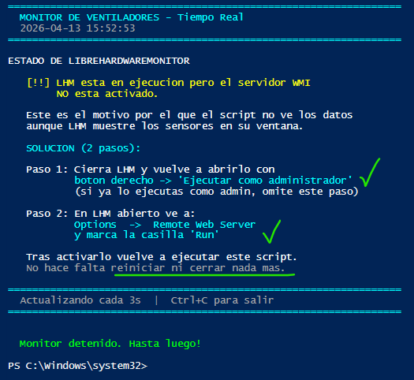

# SOLUCIÓN para activar el servidor WMI en LHM

Con LHM abierto, ve al menú **Options** (Opciones):

```powershell
LibreHardwareMonitor
  └── Options
        └── Remote Web Server    <- activa esta opcion
              └── Run            <- asegurate de que esta marcado
```

Una vez activado **LHM** registra el namespace `root\LibreHardwareMonitor` en WMI y PowerShell ya puede leerlo.

Este registro del namespace `root\LibreHardwareMonitor` en **WMI** (Windows Management Instrumentation) generalmente **no requiere un comando de registro manual**, sino que se crea automáticamente cuando se ejecuta LHM con los permisos adecuados. Sin embargo, en ocasiones no logra hacerlo y debemos asegurarnos de que funcione correctamente (necesita permisos elevados). Vamos a registrarlo manualmente utilizando PowerShell:

## Crear el Namespace con PowerShell

Si el namespace no se crea automáticamente, puedes forzar su creación en PowerShell con el siguiente comando:

```powershell
# Crear el namespace root\LibreHardwareMonitor si no existe
Get-WmiObject -Namespace "root" -Class "__Namespace" -Filter "Name='LibreHardwareMonitor'" | Remove-WmiObject
Set-WmiInstance -Namespace "root" -Class "__Namespace" -Arguments @{Name="LibreHardwareMonitor"}
```

## Verificar el Registro

Una vez ejecutado el programa, verifica que el namespace existe y está poblado con clases (como `Sensor`) usando `Get-CimInstance`:

```powershell
# Verificar las clases en el nuevo namespace
Get-CimClass -Namespace "ROOT\LibreHardwareMonitor"
```

## Consultar Datos (Ejemplo)

Si el registro fue exitoso, puedes obtener las temperaturas de CPU/GPU con este comando:

```powershell
Get-CimInstance -ClassName Sensor -Namespace ROOT\LibreHardwareMonitor | 
Where-Object {$_.SensorType -eq 'Temperature'} | 
Select-Object Name, Value, Min, Max
```

> **Nota:** Si obtienes errores, asegúrate de que LibreHardwareMonitor esté ejecutándose en ese momento, ya que la clase WMI solo está disponible mientras el programa está activo.

Por último, recordemos que **LHM** necesita ejecutarse como Administrador para acceder a los sensores de bajo nivel. Si lo tienes abierto sin privilegios de administrador puede mostrar datos en su interfaz pero no registrar el namespace **WMI** correctamente.

Cierra **LHM** y vuélvelo a abrir con **"Ejecutar como administrador"**

Igualmente se ha incluido estas opciones en el script para evitar mayores complicaciones.

- **Detectará si LHM está en ejecución** pero sin WMI activo, y dará el mensaje exacto de qué opción activar.
- **Intentará lanzar la consulta WMI con más detalle** para distinguir si LHM no está instalado, está corriendo sin WMI, o WMI está activo pero sin datos.



## La novedad clave: `Get-DiagnosticoLHM`

Esta función distingue **cuatro situaciones exactas** en lugar de decir genéricamente "no hay datos":

| Estado detectado | Qué significa | Qué muestra el script |
| --- | --- | --- |
| `no_proceso` | LHM no está instalado o no corre | Guía completa de instalación |
| `sin_wmi` | **Tu caso exacto**: LHM corre pero sin WMI activo | Instrucciones precisas de los 2 pasos |
| `wmi_vacio` | WMI activo pero hardware sin sensores Fan | Explica que puede ser limitación del HW |
| `ok` | Todo correcto, datos disponibles | Muestra los ventiladores con RPM |

---
